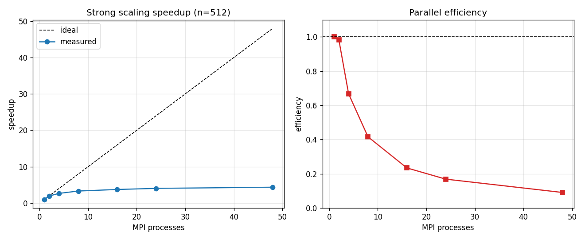
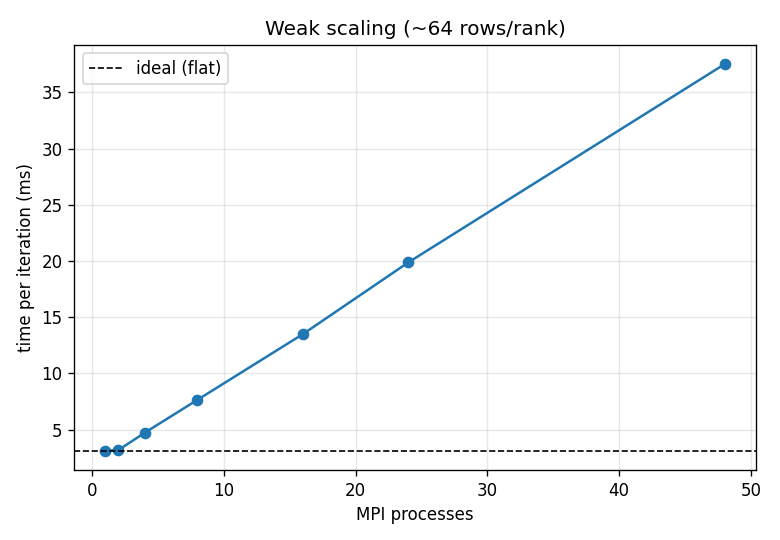
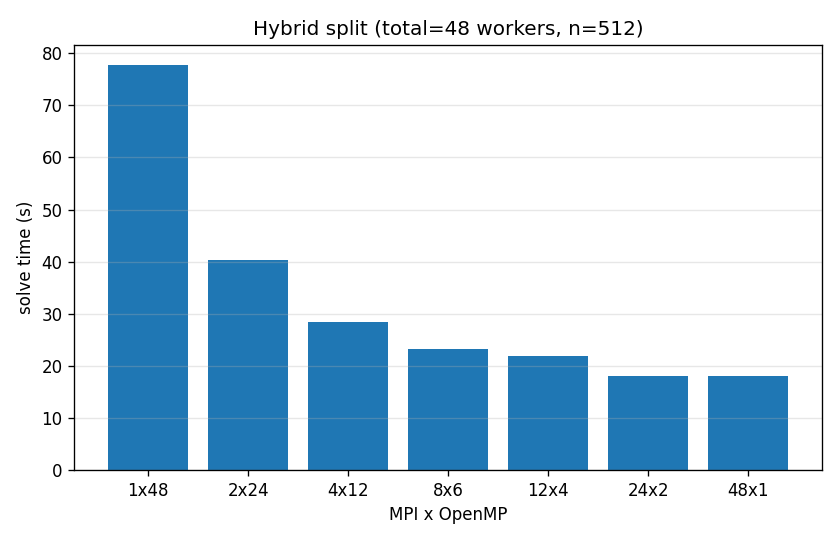
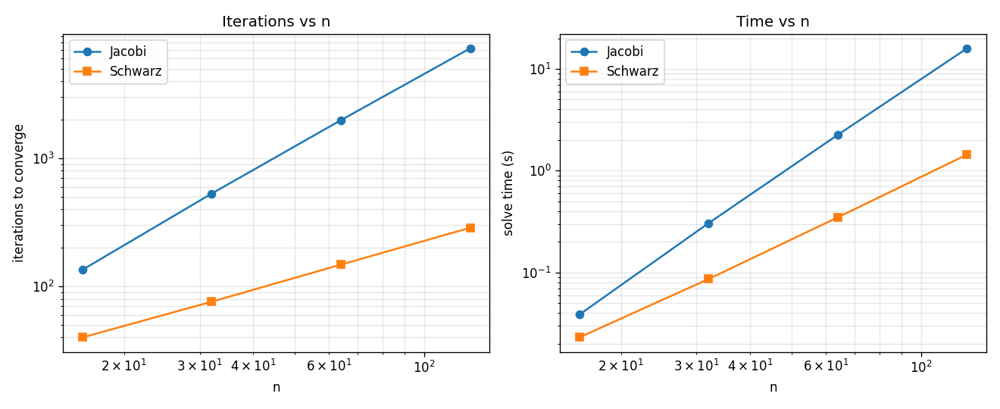
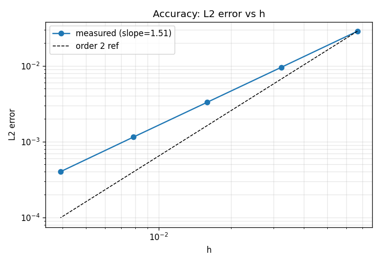

# Benchmark Results

Generated by `run_benchmarks.py`. Hardware: see `hw.info`.

## 1. Strong scaling (n=512, 3000 iterations fixed)

| NP | Time (s) | Speedup | Efficiency |
|---|---|---|---|
| 1 | 76.47 | 1 | 1 |
| 2 | 38.9 | 1.966 | 0.9829 |
| 4 | 28.63 | 2.671 | 0.6677 |
| 8 | 22.98 | 3.328 | 0.416 |
| 16 | 20.39 | 3.751 | 0.2344 |
| 24 | 18.86 | 4.055 | 0.169 |
| 48 | 17.47 | 4.376 | 0.09117 |

Efficiency drops as ranks grow because the per-iteration ghost exchange and the `MPI_Allreduce` become a larger fraction of the work (fixed problem size).

## 2. Weak scaling (~64 rows/rank, 2000 iterations)

| NP | n | Time (s) | Time/iter (ms) |
|---|---|---|---|
| 1 | 66 | 6.243 | 3.121 |
| 2 | 130 | 6.366 | 3.183 |
| 4 | 258 | 9.453 | 4.727 |
| 8 | 514 | 15.31 | 7.655 |
| 16 | 1026 | 27 | 13.5 |
| 24 | 1538 | 39.76 | 19.88 |
| 48 | 3074 | 75.05 | 37.52 |

Ideal weak scaling keeps time-per-iteration flat; the rise reflects communication overhead and the log(p) cost of the all-reduce.

## 3. Hybrid MPI x OpenMP (total=48 workers, n=512)

| MPI | OMP | Time (s) |
|---|---|---|
| 1 | 48 | 77.74 |
| 2 | 24 | 40.26 |
| 4 | 12 | 28.38 |
| 8 | 6 | 23.19 |
| 12 | 4 | 21.9 |
| 24 | 2 | 18.09 |
| 48 | 1 | 18.04 |

The optimum balances fewer MPI ranks (less communication) against OpenMP's memory-bandwidth limit — Jacobi is memory-bound, so pure-OpenMP rarely scales to the full node.

## 4. Jacobi vs Schwarz (tol=1e-6, NP=4)

| n | Jacobi iters | Jacobi time | Schwarz iters | Schwarz time |
|---|---|---|---|---|
| 16 | 135 | 0.0385 | 40 | 0.023 |
| 32 | 531 | 0.305 | 76 | 0.0862 |
| 64 | 1987 | 2.251 | 148 | 0.3479 |
| 128 | 7221 | 15.93 | 287 | 1.44 |

Jacobi's iteration count grows steeply with n; Schwarz (block-Jacobi with a direct local solve) needs far fewer outer iterations, at a higher cost per iteration.

## 5. Accuracy: L2 vs h (fitted order = 1.51)

| n | h | L2 error | Observed order |
|---|---|---|---|
| 16 | 0.06667 | 2.8565e-02 | NA |
| 32 | 0.03226 | 9.5498e-03 | 1.509 |
| 64 | 0.01587 | 3.2910e-03 | 1.502 |
| 128 | 0.007874 | 1.1486e-03 | 1.501 |
| 256 | 0.003922 | 4.0068e-04 | 1.511 |

A 5-point Laplacian is formally 2nd order. The fitted slope is the measured convergence rate; deviations from 2 indicate residual iterative error or the influence of the chosen discrete L2 norm.
